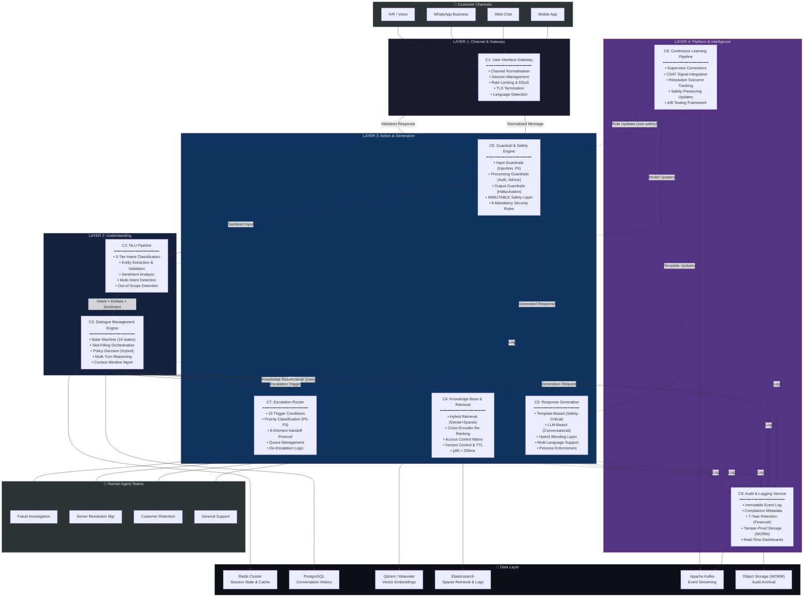
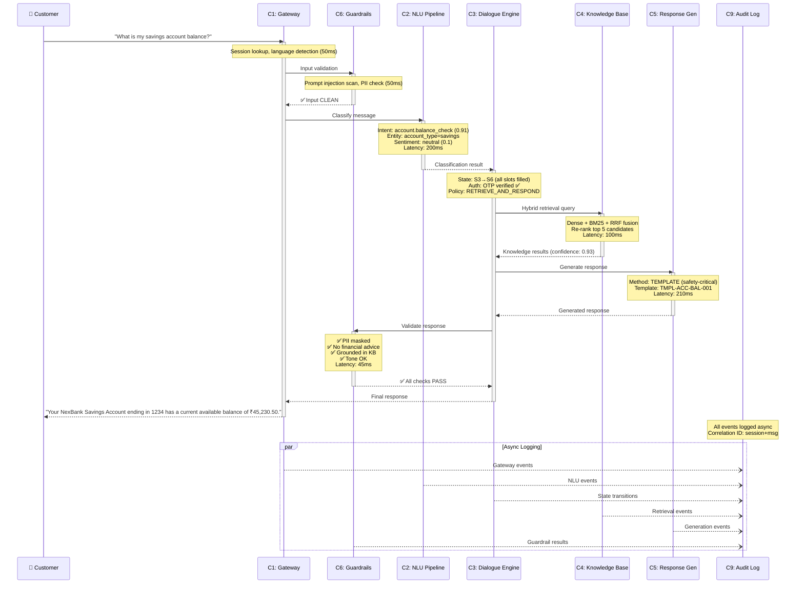
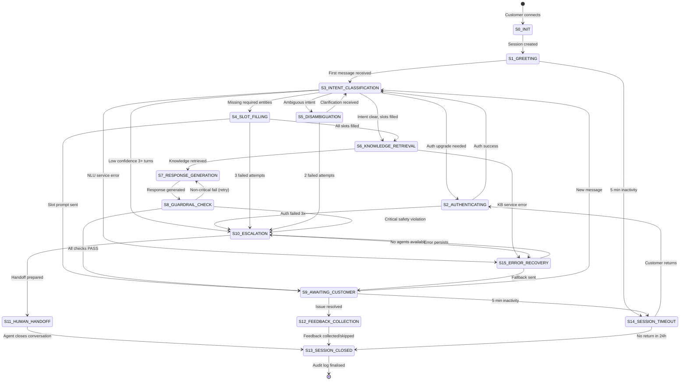
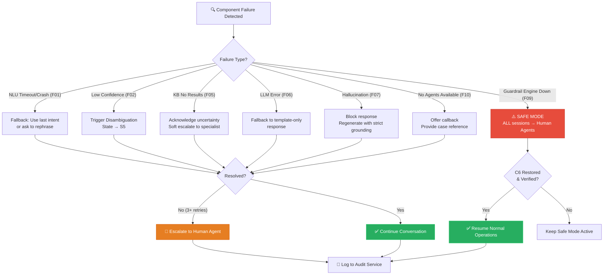
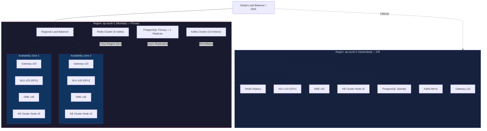

# NexBank Agentic AI — System Architecture Diagrams

## 1. High-Level System Architecture

---

## 2. Request Processing Flow (Happy Path)

---

## 3. Dialogue State Machine

---

## 4. Failure & Escalation Flow

---

## 5. Latency Budget Breakdown

```mermaid
gantt
    title End-to-End Latency Budget (p95 = 3,000ms)
    dateFormat X
    axisFormat %L ms

    section Pipeline
    C1 Gateway Input (50ms)           :a1, 0, 50
    C6 Input Guardrails (50ms)        :a2, 0, 50
    C2 NLU Classification (500ms)     :a3, 50, 550
    C3 Dialogue Policy (50ms)         :a4, 550, 600
    C4 KB Retrieval (200ms)           :a5, 600, 800
    C5 Response Generation (1500ms)   :a6, 800, 2300
    C6 Output Guardrails (100ms)      :a7, 2300, 2400
    C1 Gateway Output (50ms)          :a8, 2400, 2450

    section Parallel
    Note: Input Guardrails run parallel with NLU :milestone, 0, 0

    section Async
    C9 Audit Logging (0ms on critical path) :done, a9, 0, 0
```

---

## 6. Scalability Architecture (100x)

---

*Diagrams generated for Day 2 — System Architecture Specification*
