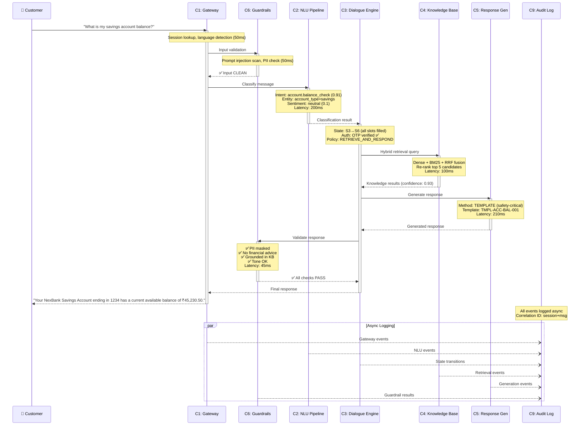
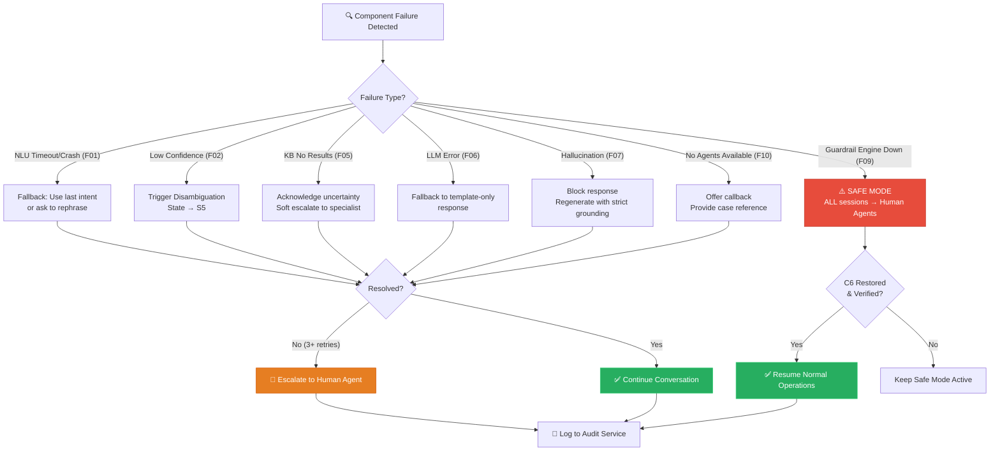
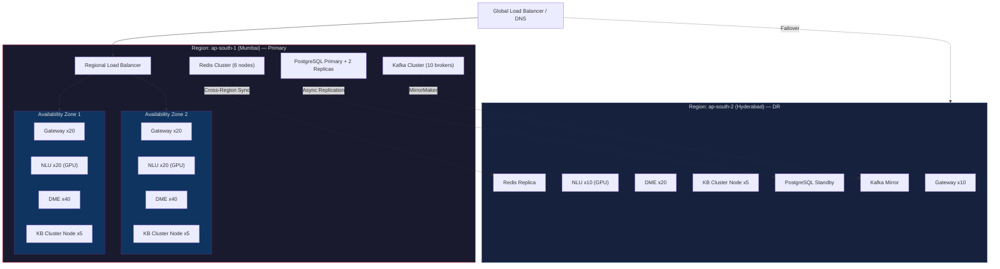

# NexBank Agentic AI — System Architecture Diagrams

## 1. End-to-End System Topology (Architecture)

```mermaid
graph TB
    %% STYLING
    classDef client fill:#2d3436,stroke:#636e72,color:#fff,rx:5px,ry:5px
    classDef gateway fill:#1a1a2e,stroke:#e94560,color:#fff,stroke-width:2px
    classDef guardrail fill:#c0392b,stroke:#e74c3c,color:#fff,stroke-width:2px,stroke-dasharray: 5 5
    classDef nlu fill:#0f3460,stroke:#533483,color:#fff
    classDef core fill:#533483,stroke:#9b59b6,color:#fff,stroke-width:2px
    classDef rag fill:#27ae60,stroke:#2ecc71,color:#fff
    classDef llm fill:#d35400,stroke:#e67e22,color:#fff
    classDef audit fill:#7f8c8d,stroke:#95a5a6,color:#fff
    
    %% NODES & SUBGRAPHS
    subgraph CLIENT_EDGE ["Client Edge"]
        APP(Mobile App) ::: client
        WEB(Web Chat) ::: client
        WA(WhatsApp) ::: client
    end

    subgraph INGRESS_LAYER ["Ingress & Pre-Flight Security"]
        GW["API Gateway (C1)<br/>Rate Limits & TLS 1.3"] ::: gateway
        PRE_GR["Pre-Flight Guardrail (C6a)<br/>PII Ingestion Gate & Base64 Scrubber"] ::: guardrail
    end

    subgraph ORCHESTRATION ["Core Orchestration"]
        DME{"Dialogue Management<br/>Engine (C3)"} ::: core
    end

    subgraph PARALLEL_NLU ["Parallel NLU Processing (C2)"]
        direction LR
        INTENT["Intent Classifier<br/>(37 Domains)"] ::: nlu
        ENTITY["Entity Extractor<br/>(15 Slot Types)"] ::: nlu
        SENTIMENT["Sentiment Analyzer<br/>(Threshold: -0.7)"] ::: nlu
    end

    subgraph RAG_PIPELINE ["Hybrid RAG Pipeline (C4)"]
        direction LR
        SPARSE[(BM25 Sparse)] ::: rag
        DENSE[(Vector DB Dense)] ::: rag
        FUSION["Reciprocal Rank Fusion<br/>(RRF k=60)"] ::: rag
    end

    subgraph GENERATION_EGRESS ["Generation & Post-Flight"]
        INFERENCE["LLM Inference Engine (C5)<br/>Temperature = 0.3"] ::: llm
        POST_GR["Post-Flight Validator (C6b)<br/>Semantic Output Scanner"] ::: guardrail
    end

    subgraph ESCALATION_AUDIT ["Safety & Compliance"]
        ESC["Escalation Router (C7)<br/>(15 Triggers, SLAs)"] ::: guardrail
        AUDIT[("Encrypted Audit Ledger (C9)<br/>AES-256 / WORM Storage")] ::: audit
    end

    %% RELATIONSHIPS & FLOW
    CLIENT_EDGE -->|"Raw Payload (JSON)"| GW
    GW -->|"Normalized Payload"| PRE_GR
    
    PRE_GR -- "Sanitized Text" --> DME
    PRE_GR -. "PII Scrub Event" .-> AUDIT
    
    DME -->|"Async Dispatch"| PARALLEL_NLU
    INTENT & ENTITY & SENTIMENT -->|"Aggregated Context"| DME
    
    DME -->|"Query Condition Meets 'KB_Required'"| RAG_PIPELINE
    RAG_PIPELINE -->|"Top-3 Chunks (Score >= τ)"| DME
    
    DME -->|"Structured Context + History"| INFERENCE
    INFERENCE -->|"Raw LLM Completion"| POST_GR
    
    POST_GR -->|"Clean Response (Latency < 2.5s)"| GW
    POST_GR -. "Financial Advice Detected!" .-> ESC
    
    DME -. "Sentiment < -0.7" .-> ESC
    
    GW & DME & INFERENCE & ESC -. "Async Event Stream (Kafka)" .-> AUDIT
```

---

## 2. Request Processing Flow (Happy Path)



---

## 3. Complex Dialogue State Machine (State Management)

```mermaid
stateDiagram-v2
    %% STATE STYLES
    classDef initial fill:#2d3436,stroke:#636e72
    classDef auth fill:#f39c12,stroke:#e67e22,color:#fff
    classDef active fill:#2980b9,stroke:#3498db,color:#fff
    classDef block fill:#c0392b,stroke:#e74c3c,color:#fff
    classDef endstate fill:#27ae60,stroke:#2ecc71,color:#fff

    [*] --> Idle : Connect
    
    state "Idle (Session Initiated)" as Idle ::: initial
    state "Authenticated_Check" as AuthCheck ::: auth
    state "Intent_Processing (NLU)" as IntentProcessing ::: active
    state "Slot_Filling_Active" as SlotFilling ::: active
    state "Context_Carryover" as ContextCarry ::: active
    state "KB_Query (RAG)" as KBQuery ::: active
    state "Guardrail_Triggered" as Guardrail ::: block
    state "Human_Escalation_Queue" as Escalation ::: block
    state "Session_Teardown" as Teardown ::: endstate

    Idle --> AuthCheck : Input Detected [Timeout = 5m]
    
    AuthCheck --> ContextCarry : [Valid Auth Token & Recent History]
    AuthCheck --> IntentProcessing : [Auth Level Matches Required]
    AuthCheck --> Guardrail : [Auth Level Insufficient for Action]

    ContextCarry --> IntentProcessing : Merge History

    IntentProcessing --> SlotFilling : [Entities Missing (Confidence > 0.85)]
    IntentProcessing --> KBQuery : [All Entities Gathered]
    IntentProcessing --> Guardrail : [NLU Detects Banned Topic]
    IntentProcessing --> Escalation : [TurnCounter > 3 w/ Low Confidence]

    SlotFilling --> IntentProcessing : Entity Provided
    SlotFilling --> Escalation : [Failed to Fill Slot > 3x]

    KBQuery --> Guardrail : [RRF Score < τ_rerank]
    KBQuery --> IntentProcessing : [KB Retrieved Successfully]

    Guardrail --> IntentProcessing : [Sanitized / Handled via Template]
    Guardrail --> Escalation : [Critical Violation / Sentiment < -0.7]

    Escalation --> Teardown : Transfer Payload to Human
    IntentProcessing --> Teardown : Task Resolved

    Teardown --> [*] : Commit to Audit Ledger
```



---

## 4. Failure & Escalation Flow



---

## 5. Latency Budget Breakdown

```mermaid
gantt
    title End-to-End Latency Budget (p95 = 3,000ms)
    dateFormat X
    axisFormat %L ms

    section Pipeline
    C1 Gateway Input (50ms)           :a1, 0, 50
    C6 Input Guardrails (50ms)        :a2, 0, 50
    C2 NLU Classification (500ms)     :a3, 50, 550
    C3 Dialogue Policy (50ms)         :a4, 550, 600
    C4 KB Retrieval (200ms)           :a5, 600, 800
    C5 Response Generation (1500ms)   :a6, 800, 2300
    C6 Output Guardrails (100ms)      :a7, 2300, 2400
    C1 Gateway Output (50ms)          :a8, 2400, 2450

    section Parallel
    Note: Input Guardrails run parallel with NLU :milestone, 0, 0

    section Async
    C9 Audit Logging (0ms on critical path) :done, a9, 0, 0
```



---

## 6. Scalability Architecture (100x)



---

*Diagrams generated for Day 2 — System Architecture Specification*
