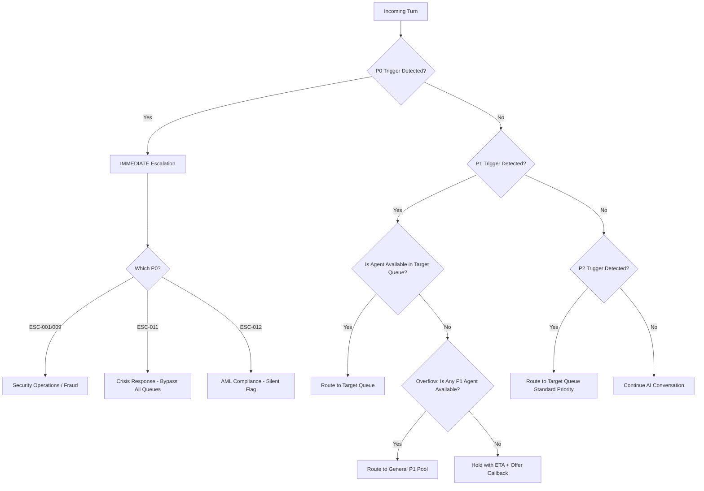

# Escalation Routing Logic & Handoff Protocol

The Escalation Router (C7) is a critical safety and customer experience component. It determines when the AI agent must hand off a conversation to a human agent, which queue the conversation enters, and what data is transferred.

## 1. The 15 Escalation Trigger Conditions

Each trigger is assigned a Priority level (P0 = Critical/Immediate, P1 = High, P2 = Standard) and a strict Service Level Agreement (SLA) for human agent pickup time.

| ID | Trigger Condition | Priority | Target Queue | SLA |
|---|---|---|---|---|
| ESC-001 | Confirmed or suspected fraud | P0 | Fraud Investigation | <2 min |
| ESC-002 | Customer threatens legal action | P1 | Senior Resolution Manager | <5 min |
| ESC-003 | NLU confidence <40% for 3+ consecutive turns | P2 | General Support | <10 min |
| ESC-004 | Sentiment score <-0.7 for 2+ turns | P1 | Customer Retention | <5 min |
| ESC-005 | Dispute exceeding ₹50,000 | P1 | Dispute Resolution | <5 min |
| ESC-006 | Customer requests human agent 3+ times | P2 | Next Available Agent | <10 min |
| ESC-007 | Account closure for high-value customer (>₹5L balance) | P1 | Relationship Manager | <5 min |
| ESC-008 | Regulatory question with uncertain answer | P1 | Compliance Helpdesk | <10 min |
| ESC-009 | Unauthorized account access reported | P0 | Security Operations | <2 min |
| ESC-010 | Conversation exceeds 15 turns without resolution | P2 | Supervisor Review | <15 min |
| ESC-011 | Customer mentions self-harm / threats / emergency | P0 | Crisis Response | IMMEDIATE |
| ESC-012 | Potential money laundering indicators | P0 | AML Compliance | <2 min |
| ESC-013 | Investment advisory requiring SEBI advisor | P1 | Wealth Advisory | <10 min |
| ESC-014 | System error preventing data access | P2 | Technical Support | <10 min |
| ESC-015 | Customer is a Politically Exposed Person (PEP) | P1 | Enhanced Due Diligence | <5 min |

## 2. Routing Decision Logic

The Escalation Router uses a deterministic decision tree to evaluate whether a conversation should be escalated and to which queue.

## 3. The 8-Element Handoff Protocol

When an escalation is triggered, the AI agent must transfer a structured data payload to the receiving human agent. This ensures the human has full context and the customer does not need to repeat themselves.

| Element | Description | Source |
|---|---|---|
| 1. **Session Transcript** | Full conversation history (masked PII) | Dialogue Management Engine (C3) |
| 2. **Intent History** | Ordered list of classified intents with confidence scores | NLU Pipeline (C2) |
| 3. **Sentiment Trajectory** | Turn-by-turn sentiment scores showing emotional arc | NLU Pipeline (C2) |
| 4. **Authentication Level** | Current auth state (Unauthenticated / OTP-Verified / Biometric) | Gateway (C1) |
| 5. **Entities Collected** | All extracted entities (account ID, amounts, dates) | NLU Pipeline (C2) |
| 6. **KB Chunks Retrieved** | The knowledge base articles used to generate responses | Knowledge Base (C4) |
| 7. **Escalation Reason** | The specific ESC-ID that triggered the handoff | Escalation Router (C7) |
| 8. **Suggested Resolution** | AI's best-guess resolution path for the human to verify | Response Engine (C5) |

## 4. Queue Management

### Priority Preemption
- A P0 escalation **always** preempts a P2 conversation in progress. The P2 customer is placed on hold with an automated message.
- P1 escalations preempt P2 but NOT other P1 conversations.

### After-Hours Routing
- **P0 (Crisis/Fraud/AML)**: 24/7 on-call team. No after-hours degradation.
- **P1**: If outside business hours (9 PM - 8 AM IST), the system offers an automated callback slot for the next business day. Exception: ESC-002 (legal threats) is routed to the after-hours senior manager on call.
- **P2**: Queued for next business day. The AI generates a case ticket and sends the customer a confirmation SMS.

### Overflow Handling
If the target queue wait time exceeds 2x the SLA, the system activates overflow:
1. Route to the nearest available agent in the same priority tier.
2. If no agents are available, offer the customer a scheduled callback.
3. Log the overflow event for capacity planning analysis.

## 5. De-Escalation Logic

Before executing an escalation, the system can attempt a single de-escalation cycle for P2 triggers only. P0 and P1 triggers are **never** subject to de-escalation.

| Trigger | De-Escalation Attempt |
|---|---|
| ESC-003 (Low confidence) | Rephrase the question and ask the user to clarify. If the next turn confidence is >60%, cancel escalation. |
| ESC-006 (Requests human 3x) | Acknowledge the frustration empathetically. Offer one final attempt: "I understand. Before I connect you, may I try one more approach?" |
| ESC-010 (15+ turns) | Summarize the conversation state and ask: "Would you like me to continue, or would you prefer to speak with a specialist?" |
