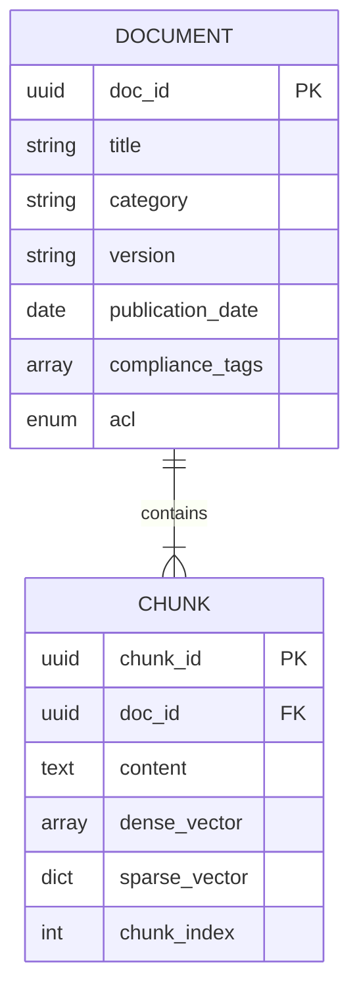

# Knowledge Base Schema & Entity-Relationship Model

This document outlines the data model for the NexBank Agentic AI Knowledge Base, enabling efficient hybrid retrieval of both highly structured data and unstructured regulatory documents.

## Dual-Representation Strategy

The knowledge base implements a dual-representation schema where raw source documents are decoupled from the semantic chunks used for vector search.

### 1. Document Level (Metadata Layer)
The Document level stores the immutable properties of the source material.

| Field Name | Type | Description |
|---|---|---|
| `doc_id` | String (UUID) | Primary key for the source document. |
| `title` | String | Human-readable title of the document. |
| `category` | String | e.g., `Product Info`, `Policy`, `Fee Schedule`, `Regulatory`. |
| `version` | String | Document version (e.g., `v1.2`). |
| `publication_date` | ISO 8601 | The date the document became active. |
| `compliance_tags` | Array[String] | Links to external references (e.g., `rbi_circular_ref: RBI/2023-24/104`). |
| `acl` | Enum | Access Control Level (`PUBLIC`, `AUTH_CUSTOMER`, `HNW_CLIENT`, `INTERNAL_ONLY`). |
| `authoring_dept` | String | Internal department responsible for the content. |

### 2. Chunk Level (Vector Layer)
The Chunk level stores the actual semantic fragments derived from the document. To preserve contextual boundaries, text is split into chunks of **200–300 tokens** with a **15–20% token overlap**.

| Field Name | Type | Description |
|---|---|---|
| `chunk_id` | String (UUID) | Primary key for the specific chunk. |
| `doc_id` | String (UUID) | Foreign key linking to the parent Document. |
| `content` | String | The raw text chunk (200-300 tokens). |
| `dense_vector` | Array[Float] | 1536-dimensional embedding (e.g., using `bge-m3` or `text-embedding-3-small`). |
| `sparse_vector` | Dict[String, Float] | BM25 term frequencies for exact keyword matching. |
| `chunk_index` | Integer | The sequential order of the chunk within the document. |

## Entity-Relationship Diagram

