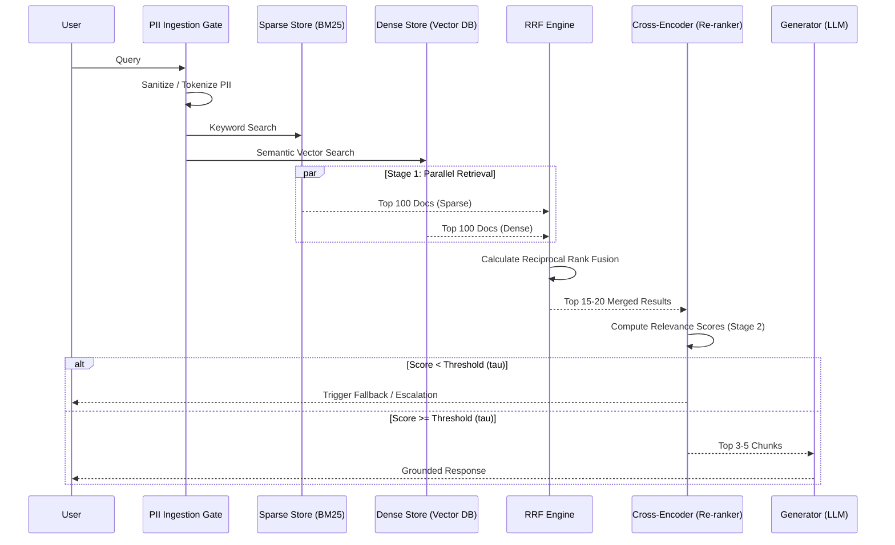

# Hybrid Retrieval Architecture

To meet the strict **<200ms latency budget ($P_{95}$)** while maintaining extremely high precision for financial queries, the NexBank Knowledge Base utilizes a two-stage hybrid retrieval pipeline.

## System Architecture

## Stage 1: Retrieval Fusion

Stage 1 runs in parallel to minimize latency.
- **Sparse Retrieval**: Uses BM25 to capture exact keyword matches (e.g., specific product codes like `NEX-CC-PREM`, explicit account terms, numerical limits).
- **Dense Retrieval**: Uses an embedding model (e.g., `bge-m3`) to capture semantic meaning and intent.

### Mathematical Framework (RRF)
To guarantee high structural precision, the pipeline merges the results using Reciprocal Rank Fusion ($RRF$). The score for a document $d \in D$ is calculated as:

$$RRF\_Score(d) = \sum_{m \in M} \frac{1}{k + r_m(d)}$$

Where:
* $M$ represents the set of retrieval strategies (Sparse BM25 and Dense Vector embeddings).
* $r_m(d)$ is the ordinal rank of document $d$ within the output of retrieval system $m$.
* $k$ is a smoothing constant set to $60$ to mitigate the disproportionate impact of low-ranked outliers.

## Stage 2: Cross-Encoder Re-ranking

The top 15–20 results from Stage 1 are passed to a lightweight Cross-Encoder model (e.g., `ms-marco-MiniLM`).
Unlike bi-encoders which process the query and document separately, the cross-encoder processes `(Query, Document)` pairs together, allowing cross-attention between terms to output a highly accurate final relevance score.

Only the **Top 3–5 chunks** are ultimately passed to the LLM's context window.

## Confidence Scoring & Uncertainty Thresholds

To prevent hallucinations, we enforce an explicit mathematical boundary on the re-ranker's output.

1. **Threshold Definition**: Let $\tau_{re-rank} = 0.75$ (configurable based on empirical A/B testing).
2. **Condition**: If the maximum score of the re-ranked documents $S_{max} < \tau_{re-rank}$:
   - The system **MUST NOT** pass the context to the LLM.
   - The generation step is bypassed.
   - An instant fallback/escalation routine is triggered (e.g., "I don't have the exact information on hand, let me transfer you to an agent.").

This guarantees the agent never guesses numerical rates or unverified policies.
